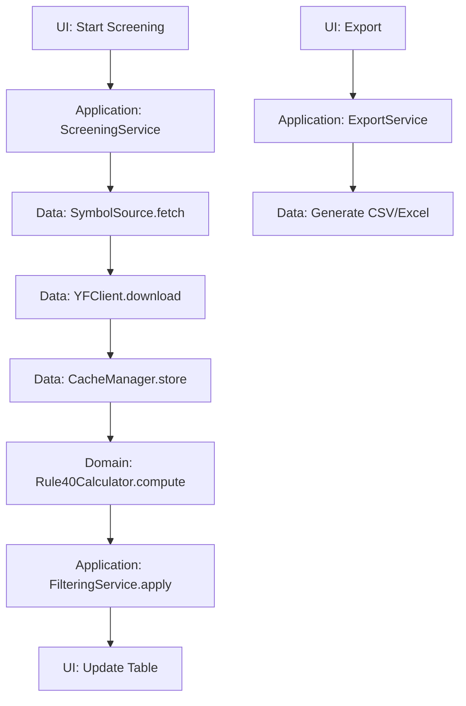

# アーキテクチャ設計

## 全体像

Rule of 40 Screener はクリーンアーキテクチャをベースに設計されています。関心分離により、保守性・テスタビリティ・拡張性を確保します。

```
┌─────────────────────────────────────────────────────────────┐
│                        UI Layer                             │
│  ┌─────────────────┐  ┌─────────────────┐  ┌──────────────┐ │
│  │  Main Window    │  │   Views         │  │  Widgets     │ │
│  │  (PySide6)      │  │   (Tables)      │  │  (Custom)    │ │
│  └─────────────────┘  └─────────────────┘  └──────────────┘ │
└─────────────────────────────────────────────────────────────┘
                              │
┌─────────────────────────────────────────────────────────────┐
│                   Application Layer                         │
│  ┌─────────────────┐  ┌─────────────────┐  ┌──────────────┐ │
│  │  Screening      │  │   Filtering     │  │  Export      │ │
│  │  Service        │  │   Service       │  │  Service     │ │
│  └─────────────────┘  └─────────────────┘  └──────────────┘ │
└─────────────────────────────────────────────────────────────┘
                              │
┌─────────────────────────────────────────────────────────────┐
│                     Domain Layer                            │
│  ┌─────────────────┐  ┌─────────────────┐  ┌──────────────┐ │
│  │ Rule40          │  │   Indicators    │  │  Utils       │ │
│  │ Calculator      │  │   (Plugin)      │  │  (Math)      │ │
│  └─────────────────┘  └─────────────────┘  └──────────────┘ │
└─────────────────────────────────────────────────────────────┘
                              │
┌─────────────────────────────────────────────────────────────┐
│                      Data Layer                             │
│  ┌─────────────────┐  ┌─────────────────┐  ┌──────────────┐ │
│  │   Adapters      │  │   Downloader    │  │   Cache      │ │
│  │ (Symbol Source) │  │  (yfinance)     │  │  (SQLite)    │ │
│  └─────────────────┘  └─────────────────┘  └──────────────┘ │
└─────────────────────────────────────────────────────────────┘
```

## レイヤー詳細

### 1. UI Layer (Presentation)

**責務**: ユーザーインターフェースの表示と操作

**主要コンポーネント**:
- `MainWindow`: フレームレスメインウィンドウ
- `ScreeningView`: スクリーニング結果テーブル
- `FilterPanel`: フィルタ設定パネル
- `ProgressWidget`: 進捗表示
- `ThemeManager`: テーマ管理

**技術**: PySide6 + QFluentWidgets

### 2. Application Layer (Use Cases)

**責務**: ビジネスルールの調整とフロー制御

**主要サービス**:
- `ScreeningService`: スクリーニング処理の調整
- `FilteringService`: フィルタリングロジック
- `ExportService`: データエクスポート
- `ConfigService`: 設定管理

### 3. Domain Layer (Business Logic)

**責務**: コアビジネスロジックとドメインモデル

**主要コンポーネント**:
- `Rule40Calculator`: Rule of 40 計算エンジン
- `Indicator`: 指標計算の抽象基底クラス
- `FinancialData`: 財務データモデル
- `Symbol`: 銘柄モデル

### 4. Data Layer (Infrastructure)

**責務**: データ取得と永続化

**主要コンポーネント**:
- `SymbolSource`: 銘柄データ取得の抽象基底
- `YFClient`: yfinance ラッパー
- `CacheManager`: SQLite キャッシュ管理
- `ConfigLoader`: 設定ファイル読み込み

## データフロー



## 主要な設計パターン

### 1. Repository Pattern

データアクセスの抽象化:

```python
class FinancialDataRepository(Protocol):
    def get_financial_data(self, symbol: str) -> FinancialData:
        ...
    
    def save_financial_data(self, symbol: str, data: FinancialData):
        ...
```

### 2. Adapter Pattern

外部データソースの統合:

```python
class SymbolSource(Protocol):
    def fetch(self) -> List[Tuple[str, str]]:  # [(symbol, name)]
        ...

class WikipediaSP500(SymbolSource):
    def fetch(self) -> List[Tuple[str, str]]:
        # Wikipedia HTML テーブルのパース
        ...
```

### 3. Strategy Pattern

指標計算の切り替え:

```python
class Rule40Strategy(Protocol):
    def calculate(self, financial_data: FinancialData) -> float:
        ...

class OPStrategy(Rule40Strategy):
    def calculate(self, financial_data: FinancialData) -> float:
        # 営業利益版の計算
        ...

class EBITDAStrategy(Rule40Strategy):
    def calculate(self, financial_data: FinancialData) -> float:
        # EBITDA版の計算
        ...
```

### 4. Observer Pattern

UI更新の通知:

```python
class ProgressObserver(Protocol):
    def on_progress(self, current: int, total: int, message: str):
        ...

class ScreeningService:
    def __init__(self):
        self._observers: List[ProgressObserver] = []
    
    def add_observer(self, observer: ProgressObserver):
        self._observers.append(observer)
```

## スレッディング設計

### 並列処理アーキテクチャ

```python
# メインスレッド (UI)
┌─────────────────────────────────────────┐
│ UI Events & Rendering                   │
│ ┌─────────────┐ ┌─────────────────────┐ │
│ │ Main Thread │ │   Timer Updates     │ │
│ └─────────────┘ └─────────────────────┘ │
└─────────────────────────────────────────┘
                    │
                    ▼ Signal/Slot
┌─────────────────────────────────────────┐
│ Worker Thread Pool                      │
│ ┌─────┐ ┌─────┐ ┌─────┐ ┌─────┐        │
│ │ W1  │ │ W2  │ │ W3  │ │ ... │        │
│ └─────┘ └─────┘ └─────┘ └─────┘        │
│ Data Download & Calculation             │
└─────────────────────────────────────────┘
```

### スレッドセーフティ

- `QThreadPool` + `QRunnable` によるワーカースレッド管理
- `QSignal` によるスレッド間通信
- SQLite 接続のスレッドごとの確保
- UI 更新はメインスレッドに限定

## キャッシュ戦略

### 多層キャッシュ

```
┌─────────────────────────────────────────┐
│ Memory Cache (LRU)                      │
│ ┌─────────────────────────────────────┐ │
│ │ Recent Financial Data (100 items)   │ │
│ └─────────────────────────────────────┘ │
└─────────────────────────────────────────┘
                    │
                    ▼ Miss
┌─────────────────────────────────────────┐
│ Disk Cache (SQLite)                     │
│ ┌─────────────────────────────────────┐ │
│ │ Persistent Cache (TTL: 24h)         │ │
│ └─────────────────────────────────────┘ │
└─────────────────────────────────────────┘
                    │
                    ▼ Miss
┌─────────────────────────────────────────┐
│ Remote Source (yfinance)                │
│ ┌─────────────────────────────────────┐ │
│ │ Yahoo Finance API                    │ │
│ └─────────────────────────────────────┘ │
└─────────────────────────────────────────┘
```

## エラーハンドリング

### 階層的エラー処理

```python
# Domain Layer
class Rule40CalculationError(Exception):
    """指標計算エラー"""

# Data Layer  
class DataFetchError(Exception):
    """データ取得エラー"""

class CacheError(Exception):
    """キャッシュエラー"""

# Application Layer
class ScreeningError(Exception):
    """スクリーニング処理エラー"""
```

### リトライ戦略

- 指数バックオフ + ジッタ
- 最大リトライ回数制限
- サーキットブレーカーパターン（将来拡張）

## 設定管理

### 設定の階層構造

```
Default Settings (config.yaml)
    ↓
User Settings (user_config.yaml)
    ↓
Runtime Overrides (CLI args / UI)
```

### 設定のバリデーション

- Pydantic による型チェック
- 設定項目の妥当性検証
- デフォルト値の自動補完

## 拡張性設計

### プラグインアーキテクチャ

```python
class Indicator(ABC):
    @property
    @abstractmethod
    def id(self) -> str:
        ...
    
    @abstractmethod
    def compute(self, financial_data: FinancialData) -> float:
        ...

# 登録機構
class IndicatorRegistry:
    def register(self, indicator: Indicator):
        ...
    
    def get_indicator(self, id: str) -> Indicator:
        ...
```

### 将来の拡張ポイント

1. **新データソース**: `SymbolSource` の実装追加
2. **新指標**: `Indicator` の実装追加  
3. **新エクスポート形式**: `Exporter` の実装追加
4. **新UIテーマ**: `Theme` の実装追加

このアーキテクチャにより、変更の影響を局所化し、システム全体の安定性を確保します。